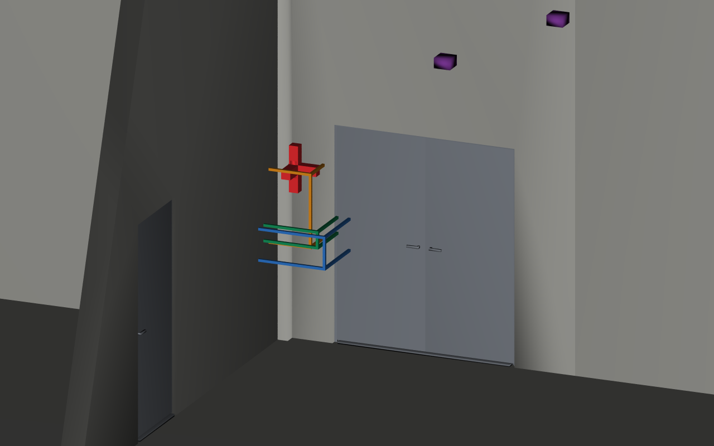

# usdAecoCompliance — requirements measured against the built model

## Use case

A reader can have the right product type and still sit at the wrong height.
This library turns applicability and clauses into USD data, then measures the
body against them. See the [use case](docs/usecase.md) and [measurement contract](docs/measurements.md).

## The schema on an index card

| Schema | Meaning | Properties |
|---|---|---|
| `AecoSpecification` | A document's applicable scope | `aeco:spec:` title, source, sourceDocument, appliesToClassification, appliesToTypes, kind |
| `AecoRequirement` | An independently addressable clause | `aeco:req:` measure, operator, values, tokens, unit, tolerance, severity, rationale |
| `AecoComplianceAPI` | Derived result on an existing Imageable | `aeco:compliance:` specifications, status, report |

Specifications and clauses fall back to `Scope`. Document `kind` describes
source authority; product kinds remain core classifications. All three result
properties carry `aecoDerived = true`. The [schema](usdAecoCompliance/schema.usda)
is the contract; [IDS and IFC mapping](docs/mapping.md) describes its limits.

## The example

The pinned `iris` variant supplies eleven reader bodies. Three illustrative
YAML specifications become three USD layers. The evaluator finds **10 pass,
1 fail**, with two failed height clauses on the same reader at **1.65 m**.

Open `examples/datacentre/result/example.usdc` in any USD viewer, without family
plugins. The crate contains the full building, results and drawing sheets. Its
vanilla view looks into the office-link door region: the red reader at 1.65 m
sits above the blue accessibility and green employer height bands; the amber
datasheet band includes it. Every original reader body is coloured by verdict. The
[example instructions](examples/datacentre/README.md) reproduce the run.



```sh
env -u PYTHONPATH python examples/datacentre/run.py --publish
```

Outputs: `result/example.usdc`, original own layers under `result/layers/`,
`result/vanilla.png`, facility and diagram PNGs, and a hash inventory. The
`facility` camera shows all eleven locations in the ground-floor model; `plan`
and `elevation` preserve the original drawing sheets under `renders/`. Ordinary
runs write only the ignored `out/`; `expected/findings.json` is never replaced.

## Build and check

Use an existing Python environment with OpenUSD, PyYAML, Pillow, pytest and the
pinned toolchain's dependencies. No installation of this package or setuptools
is required. Set each dependency location to its checkout, and put `usdrecord`
on `PATH`. These relative paths assume sibling checkouts:

```sh
export TOOLCHAIN_DIR=../usdaeco-toolchain
export CORE_DIR=../usdaeco-core
export CORE_PLUGIN_DIR="$CORE_DIR/usdAeco"
export AECO_DATACENTRE_ROOT=../usdaeco-datacentre
export PXR_PLUGINPATH_NAME="$CORE_PLUGIN_DIR:$PWD/usdAecoCompliance:$PWD/usdAecoComplianceValidators"
export PYTHON=python
bash build.sh
env -u PYTHONPATH PYTHONPATH="$CORE_DIR:$PWD" python check.py
env -u PYTHONPATH python -m pytest -q
```

`check.py` prints the family `N checks, M failed` summary. Missing core validators
are a setup failure, never a skipped check. Tests insert `tools/` into `sys.path`.
The committed source plugin above carries the checked core version; an installed
plugin may instead be selected with `CORE_PLUGIN_DIR` after verifying its version.
To call the companion directly from source:

```sh
env -u PYTHONPATH python tools/run_compliance.py check examples/datacentre/out/example.usda \
  --output examples/datacentre/out/rechecked.usda --report examples/datacentre/out/rechecked.json
```

`aeco-compliance check` is the packaging entry point for the same command. Exit
0 means no hard finding, 1 means a hard finding, and 2 means invalid invocation.
To build under Nix, run `nix flake check`. Public GitHub inputs match
`dependencies.json`. Private registry or `--override-input` mappings belong
outside this checkout; see the toolchain's `docs/repo-conventions.md`. Dependency
resolution is not yet proven in this environment; see [validation evidence](docs/validation.md).

## Family

Requires `usdAeco >=0.9.2,<1.0`. Checked pins are core v0.9.5, axis v0.1.5,
toolchain v0.3.10 and data centre v0.4.8. Axis is an integration pin; compliance
does not import its schema or depend on another kind library. Device queries
read core identity, classification, inherited types, spatial containment and
marked body geometry. The scenarios family manifest and family board consume
this repository's manifest and results.

## Layout

| Path | Contents |
|---|---|
| `usdAecoCompliance/` | Source/generated codeless schema, minimal example, user documentation |
| `usdAecoComplianceValidators/` | Seven registered Python UsdValidation rules |
| `tools/usdaeco_compliance/` | YAML conversion, measurement, evaluation, CLI and figure authoring |
| `testenv/` | Schema, seeded defects, geometry and layer-composition drills |
| `examples/datacentre/` | Illustrative inputs, expected findings and self-contained result |
| `docs/` | Use case, mapping, measurements and validation evidence |

## Status

Version 0.1.3: **48 checks, 0 failed; structure 29/0; pytest 40 passed**.
Public release pins, unchanged result layers and fresh stock renders are verified; see
[validation evidence](docs/validation.md).
The iris example demonstrates eleven readers and two height
violations on one reader. All example values are **illustrative**, not verified
regulatory content. Door distance uses the combined leaf/frame envelope;
clear floor area is conservative rectangular subtraction. No IDS XML or IFC
constraint exporter is shipped. See [measured checks and deviations](docs/validation.md).

## Licence

MIT. See [LICENSE](LICENSE). Runtime dependencies retain their licences:
OpenUSD (Apache-2.0-style), PyYAML (MIT), Pillow (HPND), and the toolchain (MIT).
