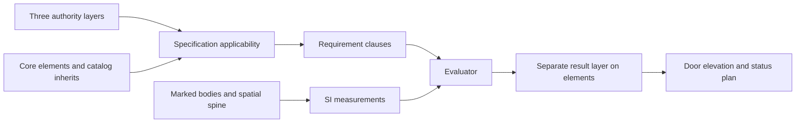
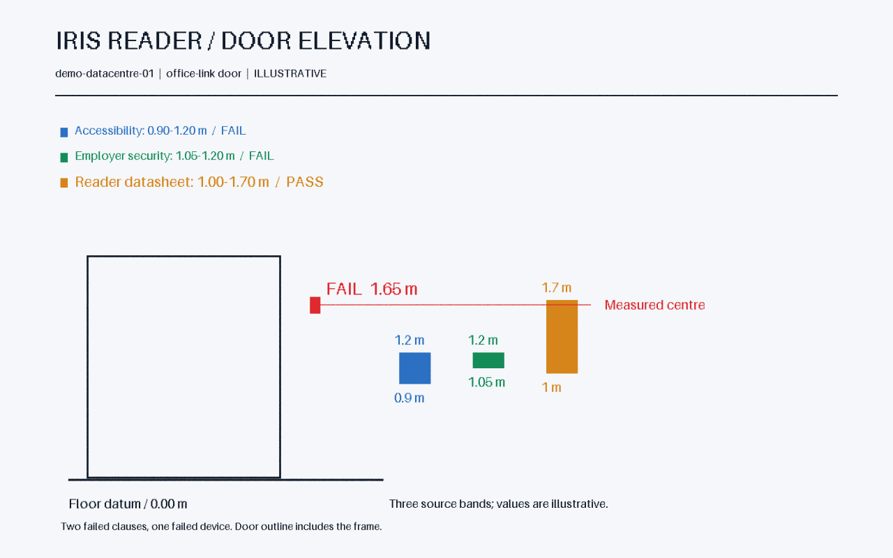
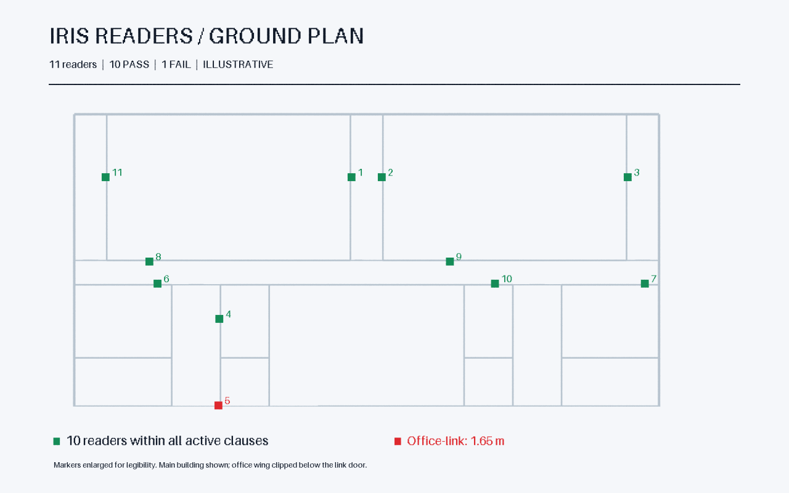

# Requirements and compliance

## 1 The problem

Accessibility, security and supplier requirements arrive as prose. A reviewer
must join them to the right products, floor levels and geometry. A device may
look plausible in a model yet be outside the required height band. This
example makes that disagreement visible and traceable to individual clauses.

## 2 The data as it arrives

The data-centre release supplies eleven iris reader bodies, classifications,
inherited catalog types and exported properties. Three YAML files carry
illustrative accessibility, employer-security and datasheet clauses. Source
measures `MountingHeight`, `DoorEdgeOffset` and `Side` are translated into
measured quantity tokens; their nominal reader properties are not used as
measurement answers. Every source declares `illustrative: true`.

## 3 The model in USD

`AecoSpecification` and `AecoRequirement` are record referents: deleting one
removes a document scope or clause, not a property of a device. They inherit
`Typed`, never the core spatial or group bases. Existing elements retain their
identity, type and parent. `AecoComplianceAPI` carries only the derived result.
The exact `spec`, `req` and `compliance` namespaces are declared in library metadata.



Classifications are system-qualified selectors, matched exactly or at a dotted
subclass boundary. Entries within one selector list are alternatives; nonempty
classification and type filters combine with AND. Type matching follows composed
`inherits`. [Mapping](mapping.md) describes the conceptual IDS and IFC correspondence.

## 4 Workflow

1. Configure dependency locations as shown in the README and run `bash build.sh`.
2. Convert the committed YAML inputs without modifying the data-centre checkout:

   ```sh
   env -u PYTHONPATH python tools/run_compliance.py convert examples/datacentre/inputs \
     --stage "$AECO_DATACENTRE_ROOT/dist/iris/dc.usda" \
     --type-map examples/datacentre/inputs/type-map.json \
     --output-dir examples/datacentre/inputs
   ```

3. Run `env -u PYTHONPATH python examples/datacentre/run.py --publish`. Open
   `examples/datacentre/result/example.usdc` or either committed PNG.
4. Review the clause lines in `aeco:compliance:report`, or the full structured
   `out/report.json`. Correct model drivers upstream and regenerate the body;
   recheck to replace the separate result layer.
5. Audit authority with USD layer muting, then rerun the evaluator. Removing a
   requirement layer never moves a reader. Muting both hard height sources leaves
   the datasheet band, which accepts 1.65 m. Muting only accessibility retains
   the independent employer clause and therefore retains one height violation.

Layers are ordered regulations, project specification, datasheet. USD strength
resolves opinions on the same clause path; there is no numeric priority
algorithm. Distinct clauses remain distinct obligations and combine with AND.
Tests also override the same clause in two layers, proving that muting the
stronger opinion reveals the weaker bound and changes the verdict.

## 5 Validation

| Rule | Severity | Defect caught |
|---|---|---|
| RequirementUnmeasurable | error | Unknown token, malformed comparison, unsupported unit, missing body/property |
| SpecificationWithoutApplicability | error | Neither classification nor type applicability |
| ComplianceStale | error | Body, placement, property, classification or clause input changed after checking |
| MissingDevice | error | Specification matches no current element |
| MisplacedDevice | clause error/warn | Measured placement falls outside a clause |
| UnapprovedProduct | clause error/warn | Catalog property fails an approval clause |
| MissingBinding | error | Source door reference unresolved, or geometric association missing/ambiguous |

All seven rules register with `UsdValidation.ValidationRegistry`. Public finding
kinds retain `missingDevice`, `misplacedDevice`, `unapprovedProduct` and
`missingBinding`; validator error names use ProperCase. Freshness is a content
fingerprint in result-layer metadata, not a timestamp comparison. Missing data
never earns a pass. A previously checked element with no current applicable
clauses becomes `notApplicable`. [Measurement limits](measurements.md) are explicit.

## 6 The example on the demo data centre

The pinned iris stage has eleven readers. Ten body centres are 1.20 m above
their containing level datum; the office-link reader is 1.65 m. There are
**10 passing devices and 1 failing device**, with two failed clauses:
`/Specifications/accessibility/Clause01` and
`/Specifications/employer_security/Clause01`. Both report **1.65 m**. All readers
pass the offset and pull-side checks, and all pass the illustrative datasheet.

Base element/space/mesh counts in findings are read from the release's
`dc.manifest.json`. The converter preserves the three YAML inputs and their
labels. No value is represented as verified regulatory text.





The separate USD presentation layer colours the eleven original reader bodies
and draws the three clause envelopes at their actual locations. The vanilla
view looks into the office-link door region, with the failing reader above the
hard height bands. A ground-floor facility view locates all eleven readers;
its camera clips at 2.4 m without changing any source geometry. The original
elevation and plan sheets remain in a separate diagram layer and `renders/`.
Presentation is excluded from measurement inputs. Enlarged status crosses
identify measured centres; they are not replacement reader geometry.
The flattened crate remains viewable after relocation without family plugins.

## 7 Trade-offs and alternatives

Authored mounting-height properties are easier to read but can disagree with
the derived body, so this evaluator measures geometry. Body envelopes are cheap
and deterministic; they cannot identify a sensor's optical centre or separate
an unsplit door mesh into semantically identified leaves. The centre and
leaf-edge names have the explicitly bounded v0.1 interpretation in
[measurements.md](measurements.md). A richer leaf representation would improve it.

Independent document clauses are all checked. A supplier band does not silently
cancel an employer clause; USD overrides occur at shared clause addresses.
This preserves auditability and avoids inventing a second authority mechanism.

## 8 Out of scope and open questions

Verified code ingestion, IDS XML import/export, IFC constraint export, automatic
optical-centre identification, arbitrary floor polygons, route clearance and
door-swing simulation are outside v0.1. Empty-scope `missingDevice` finds an
absent population; it does not specify a required device count per door. The
published crate is a frozen inspection snapshot; freshness applies to the
editable source/result composition, whose layer provenance is preserved separately.

## 9 Status

Version 0.1.3: codeless schema, YAML converter, five measured tokens, CLI,
seven validators, seeded defects, an iris example, two facility views and two preserved diagram figures.
Acceptance evidence and deviations are maintained in [validation.md](validation.md).
