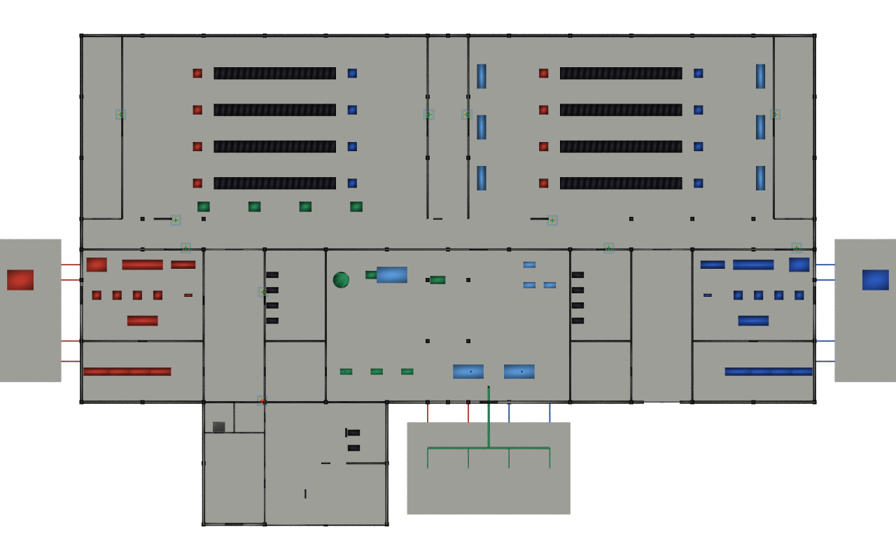

# Iris reader compliance

Inputs are the pinned data-centre v0.4.6 `iris` stage and three committed
illustrative YAML specifications. `type-map.json` resolves the source catalog
selector to the catalog class path. The generated USD layers are strongest-first:
`01-accessibility.usda`, `02-employer-security.usda`, `03-reader-datasheet.usda`.

After configuring the environment in the repository README, run:

```sh
env -u PYTHONPATH python examples/datacentre/run.py --publish
```

Expected: **11 readers, 10 pass, 1 fail**. The office-link body centre is **1.65 m**,
outside both hard height bands. The two clause paths and measured values appear
in `expected/findings.json` and the result attributes. General stage counts come
from `dc.manifest.json`; they are not constants in the evaluator.

Open `result/example.usdc` in stock `usdview`. The entire pinned facility is
composed. The cameras are:

| Camera | View |
|---|---|
| `/Renders/overview` | The actual office-link door region, failing red reader and illustrative height envelopes; used for `result/vanilla.png` |
| `/Renders/facility` | The ground-floor facility with all eleven reader locations, clipped at 2.4 m by the camera |
| `/Renders/elevation` | Preserved door elevation diagram with the three labelled bands |
| `/Renders/plan` | Preserved labelled plan diagram with all eleven statuses |

The presentation layer colours the original ten passing reader bodies green
and the failing body red. Enlarged crosses locate their measured centres.
Envelope mesh bars show accessibility (blue, 0.90–1.20 m), employer (green,
1.05–1.20 m) and datasheet (amber, 1.00–1.70 m) bands; their heights are read
from the composed clauses. These illustrative symbols are separate from the
measured bodies. The standalone vanilla render uses stock USD and Embree.




Geometry and identity in the source remain unchanged. `result/layers/` preserves
`compliance.usda`, `presentation.usda` and `diagrams.usda` separately alongside
the inputs. `run.py` creates the ignored `inputs/source` alias pointing at
`AECO_DATACENTRE_ROOT`; no fixed sibling layout is needed. The v0.4.6 release
retains the iris publication generated at v0.4.2, with unchanged source hashes.

`out/report.json` has every measured clause, including passing checks. The
ordinary runner writes only `out/`; `--publish` refreshes committed results and
images after comparing expected findings. Re-run the README's converter command
to regenerate the input layers; it never writes into the data-centre checkout.

All limits are illustrative. The door-edge check measures the combined frame
and leaf envelope; the precise leaf edge is not proven. See
[measurement limits](../../docs/measurements.md) and [validation](../../docs/validation.md).
