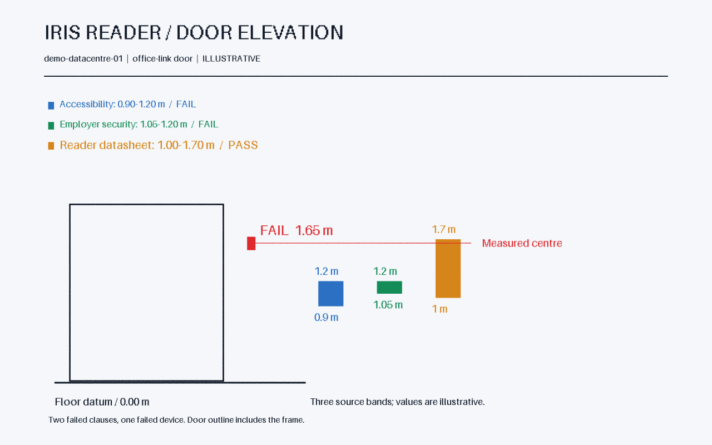

# usdAecoCompliance

Represent document applicability and clause benchmarks as records, then check
core elements against their composed body geometry. `AecoComplianceAPI` writes
status and a clause-by-clause report in a separate derived layer.

Start with the [minimal example](../examples/minimal.usda), whose one reader
passes an illustrative height band. The [iris example](../../examples/datacentre/README.md)
checks three documents against eleven readers, finding one device at 1.65 m.

`AecoSpecification` and `AecoRequirement` fall back to `Scope` without plugins.
The API applies to `Imageable`. See [measurement definitions](../../docs/measurements.md)
and the [IDS/IFC correspondence](../../docs/mapping.md).
